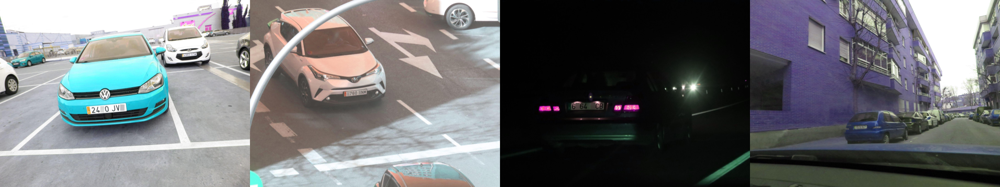
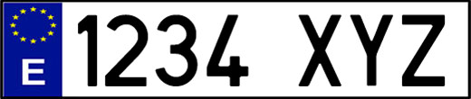
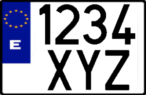
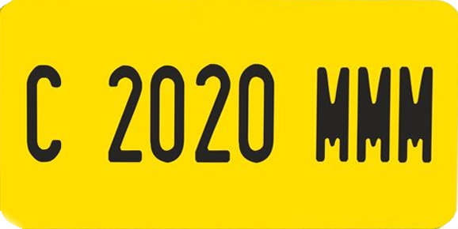

# UC3M-LP

UC3M-LP dataset is a comprehensive and open-source collection of annotated images for European (Spanish) license plate detection and recognition tasks. Researchers and developers are encouraged to use the UC3M-LP dataset to develop and evaluate algorithms for license plate detection, localization, character segmentation, and optical character recognition (OCR). The dataset also supports various research areas such as vehicle surveillance, automated toll systems, traffic analysis, and security applications.

It is the largest open-source dataset for European license plate detection and recognition and the first one ever dedicated to Spanish license plates. It contains 1975 images from 2547 different vehicles with their corresponding license plate, comprising a total of 12757 plate characters.

## Overview

The dataset is split into train, with 1580 images (80%), and test, with 395 images (20%). Each one of the 2547 license plates has been labeled with a two letter code. The first letter refers to the typology of Spanish license plates:

- Type A: 2498 samples of the most common long, one row with white background.

    

- Type B: 31 samples of motorcycle double row and white background.

    

- Type C: 1 sample of light motorcycle one row with yellow background.

    

- Type D: 11 samples of taxis and VTC (Spanish acronym for private hire vehicle) with blue background.

    

- Type E: 6 samples of trailer tows with black characters and red background.

    

and the second letter refers to the lighting conditions:

- Type D: 2185 samples at daytime.
- Type N: 362 samples at nighttime.

<!-- ## Citation -->

<!-- If you use this dataset in your research, please cite the following paper: -->

<!-- Waiting for acceptance -->

